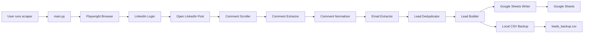
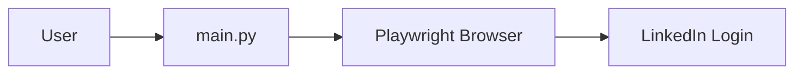
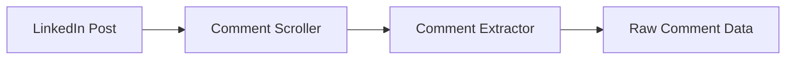
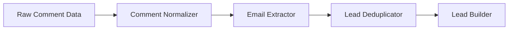
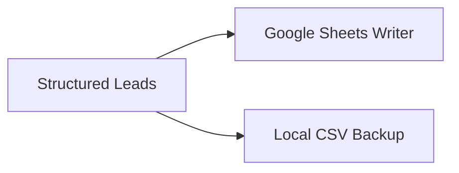
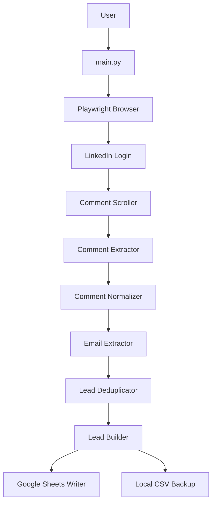
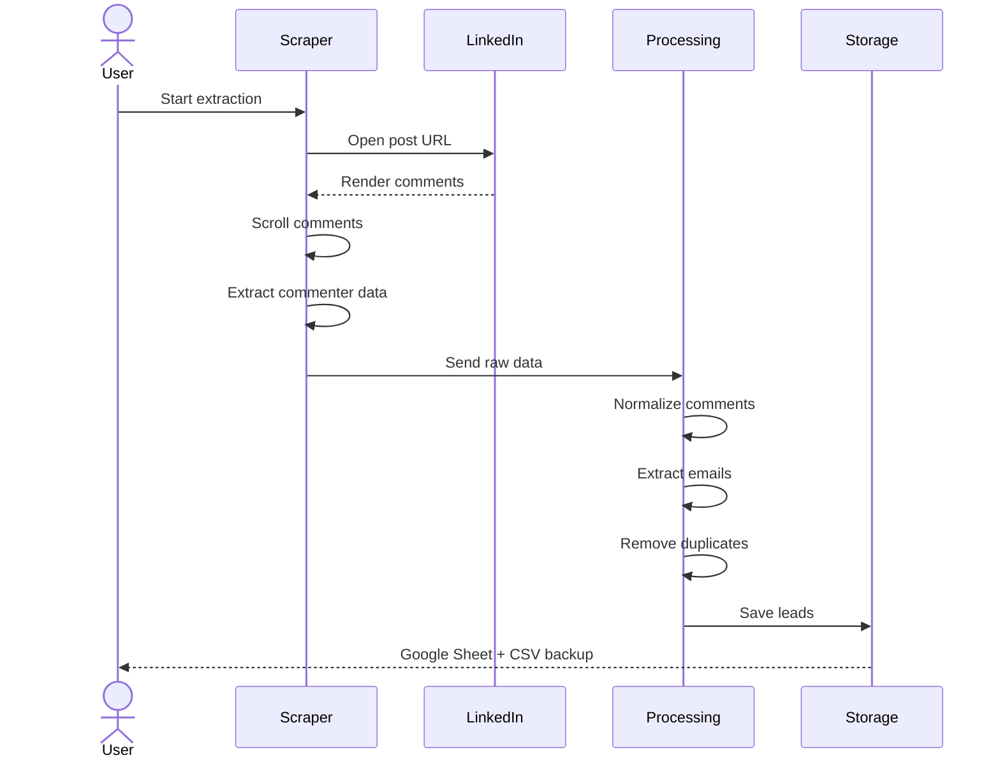

# LinkedIn Post Comment Lead Extraction System

> Automated system that extracts potential leads from LinkedIn post comments and exports them into structured datasets such as Google Sheets or Excel.

The system uses browser automation to open LinkedIn posts, scroll through comments, extract commenter information, and transform engagement into structured leads that can be used for outreach, sales prospecting, or marketing workflows.

---

# Overview

LinkedIn posts often generate engagement from potential customers, collaborators, and decision makers. However, manually collecting leads from comment sections is slow and inefficient.

This system automates the entire workflow.

Instead of manually browsing comments, the system automatically:

1. Opens a LinkedIn post
2. Logs into LinkedIn
3. Dynamically loads all comments
4. Extracts commenter information
5. Processes and cleans the extracted data
6. Detects emails from comments if present
7. Stores leads in Google Sheets
8. Maintains a local CSV backup

The architecture is modular so each stage of the pipeline can evolve independently.

---

# Key Features

- Automated LinkedIn login
- Dynamic comment loading and scrolling
- Comment and profile extraction
- Email detection from comment text
- Duplicate lead removal
- Lead normalization and formatting
- Google Sheets integration
- Local CSV backup for fault tolerance
- Logging and retry system
- Modular and extensible architecture

---

# System Architecture

The following diagram shows the high-level workflow of the entire system.



---

# Browser Automation Layer

This layer initializes the browser and handles LinkedIn authentication.



### Components

| Component | File | Responsibility |
|---|---|---|
| Entry Controller | main.py | Starts the entire scraping workflow |
| Browser Manager | scraper/browser.py | Initializes Playwright browser |
| Authentication Handler | scraper/linkedin_login.py | Performs LinkedIn login |

---

# Comment Scraping Layer

This layer loads and extracts comments from LinkedIn posts.



### Components

| Component | File | Responsibility |
|---|---|---|
| Comment Scroller | scraper/comment_scroller.py | Loads comments dynamically |
| Comment Extractor | scraper/comment_extractor.py | Extracts commenter data |

---

# Data Processing Layer

Raw comment data is cleaned and transformed into structured leads.



### Components

| Component | File | Responsibility |
|---|---|---|
| Comment Normalizer | processing/comment_normalizer.py | Cleans comment text |
| Email Extractor | processing/email_extractor.py | Detects email addresses |
| Deduplicator | processing/deduplicator.py | Removes duplicate leads |
| Lead Builder | processing/lead_builder.py | Builds structured lead objects |

---

# Storage Layer

The processed leads are exported to external storage systems.



### Components

| Component | File | Responsibility |
|---|---|---|
| Sheets Writer | sheets/sheets_writer.py | Writes leads to Google Sheets |
| CSV Backup | leads_backup.csv | Local fail-safe storage |

---

# Final System Architecture

The complete pipeline combines all components together.



---

# Data Flow

The following diagram describes the lifecycle of a scraping run.



---

# Tech Stack

| Category | Technology |
|---|---|
| Language | Python |
| Browser Automation | Playwright |
| Data Processing | Python |
| Storage | Google Sheets API |
| Backup Storage | CSV |
| Configuration | python-dotenv |
| Logging | Python logging |

---

# Project Structure

```
main.py
requirements.txt
.env
leads_backup.csv

config/
    settings.py

scraper/
    browser.py
    linkedin_login.py
    comment_scroller.py
    comment_extractor.py
    lead_processor.py

processing/
    comment_normalizer.py
    email_extractor.py
    deduplicator.py
    lead_builder.py

sheets/
    sheets_writer.py

utils/
    logger.py
    retry.py
    human_delay.py
    hashing.py
    safe_query.py
    time_utils.py

logs/
    app.log
    error.log
```

---

# Output Format

| extracted_at | post_url | commenter_name | commenter_profile_url | comment_text | email |
|---|---|---|---|---|---|
| 2026-03-07T10:12:00 | linkedin.com/post/... | Rahul Sharma | linkedin.com/in/rahul | Interested | rahul@gmail.com |
| 2026-03-07T10:13:00 | linkedin.com/post/... | Aman Gupta | linkedin.com/in/aman | Please share details | |

---

# Backup CSV Mechanism

If Google Sheets fails due to API or network errors, the system still saves leads locally in:

```
leads_backup.csv
```

This ensures no extracted data is lost.

---

# Installation

Clone the repository:

```
git clone <repo_url>
cd linkedin-comment-lead-extractor
```

Install dependencies:

```
pip install -r requirements.txt
```

Install Playwright browsers:

```
playwright install
```

---

# Configuration

Create `.env` file:

```
LINKEDIN_EMAIL=
LINKEDIN_PASSWORD=

GOOGLE_SERVICE_ACCOUNT_FILE=service_account.json
GOOGLE_SHEET_NAME=LinkedIn Leads
```

---

# Running the Application

Run:

```
python main.py
```

The system will:

1. Open LinkedIn
2. Login
3. Load comments
4. Extract commenter information
5. Process the data
6. Store leads in Google Sheets
7. Save backup CSV

---

# Logging

Logs are stored in:

```
logs/app.log
logs/error.log
```

---

# Future Improvements

- Proxy rotation support
- Multi-post scraping
- Lead enrichment APIs
- CRM integration
- Automated outreach generation
- Distributed scraping workers
- Dashboard for monitoring scraping runs

---

# Author

Shaktesh Pandey  
GitHub: https://github.com/shaktiap1
